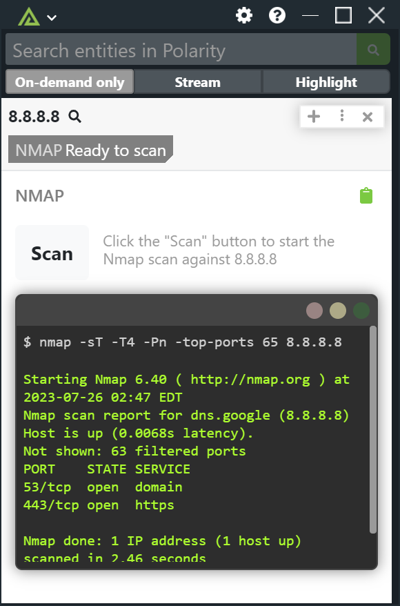

# Polarity Nmap Integration

Nmap ("Network Mapper") is a free and open source utility for network discovery and security auditing. When triggered by the user, the polarity Nmap integration runs an aggressive TCP Connect port-only scan on the specified IP address.  

More specifically, the following scan is run on the specified IP address:

```
nmap -sT -T4 -Pn -top-ports 64 <ip address>
```

**Important** -- You must have the `nmap` utility installed on your Polarity Server for this integration to work. If you see the following error message then your Polarity Server does not have `nmap` installed:

```
/bin/sh: nmap: command not found
```

You can install `nmap` with the following command:

```bash
sudo yum install nmap
```

|  |
|---------------------------------------------|
| *Nmap Scan Example*                         |

### Top Ports

This setting controls how many ports will be scanned based on NMAP's built-in port popularity"

### Private IPs Only

If checked, the integration will only support scanning of private (RFC-1918) IP addresses.

## About Polarity

Polarity is a Federated Search platform that improves and accelerates analyst decision making. For more information about the Polarity platform please see:

https://polarity.io/
